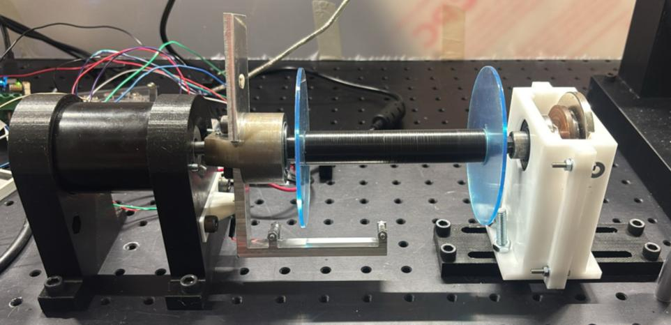
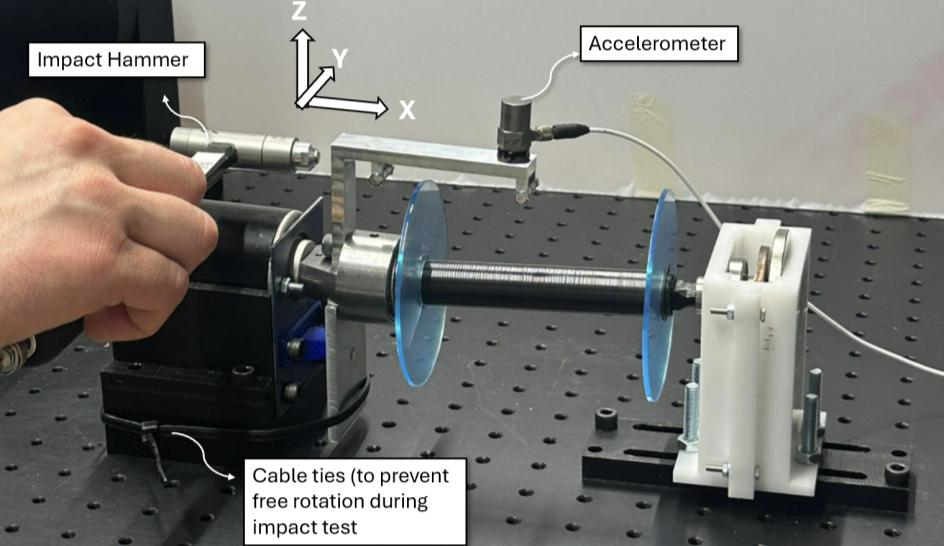
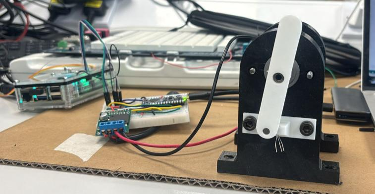
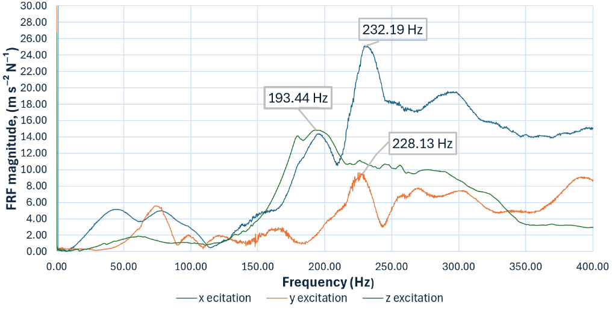
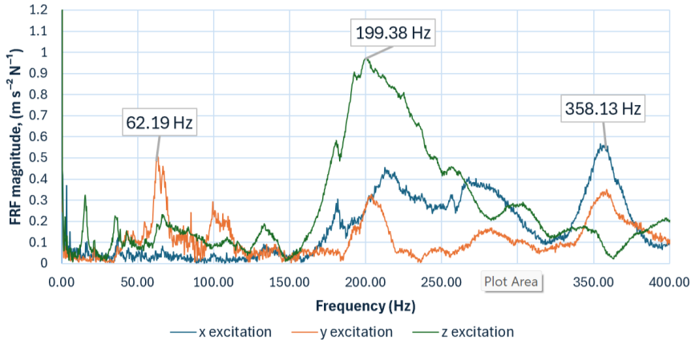
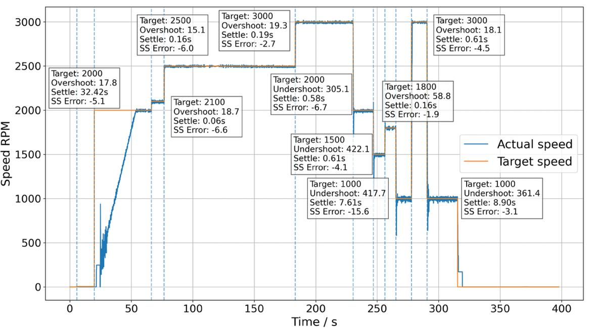

# Hi, I'm Joy Huang 👋

## Software, robotics and embedded systems engineer

I am a final-year Mechanical Engineering MEng student at Imperial College London specialising in robotics, control and intelligent electromechanical systems, with hands-on experience developing embedded C and Python software for autonomous and closed-loop systems. I am experienced in microcontrollers, motor control, PID control, sensor integration, I²C/UART communication, numerical modelling and experimental validation, with C++ and ROS 2 currently under development. I am particularly motivated to apply software, control and robotics engineering to the development of safe and reliable medical robotic systems.

## Personal story

My interest in healthcare is personal. Having seen close family members experience serious and long-term health problems, I have wanted to use engineering in a field where my work can make a meaningful difference to people’s lives. This became more tangible through a conversation with a surgeon about the number of patients waiting for treatment and the limited number of procedures a surgeon can perform each day. Hearing how surgical robotics could improve efficiency and help more patients receive treatment showed me how software, control and physical-system engineering could contribute to a healthcare challenge I genuinely care about.

My interest in robotics began during my A-levels, when I led a team in a robotics competition at the University of Cambridge and achieved third place. I enjoyed seeing software, mechanics and control come together to make a physical system behave intelligently. At Imperial College London, my interests in healthcare and robotics have increasingly converged into a clear ambition to work in medical and surgical robotics.

I have shaped my final year around this direction through Robot Dynamics & Control, Advanced Control, Machine Learning, Robotic Manipulators & Automation Technology, and a year-long medical robotics research project at Imperial’s Hamlyn Centre for Robotic Surgery. Alongside this academic direction, my engineering projects have given me hands-on experience at the interface between software and physical systems.

## Featured projects

### Robotics Software & Control Project — C++, ROS 2
**C++ · ROS 2 · robotic kinematics and control · in progress**

Developing a simulated robotic manipulator in C++ and ROS 2. The project is progressing from C++ fundamentals through forward and inverse kinematics, trajectory generation, feedback control, and an integrated simulation demonstrating robot modelling, motion planning, and control.

*Repository link to be added when the first publishable milestone is ready.*

### Autonomous Embedded Systems Buggy — Embedded C / PIC18
**Embedded C · PIC microcontroller · PWM · I²C · UART**

Designed and implemented an autonomous robotic buggy in Embedded C on a PIC microcontroller, integrating motor control, colour sensing, and navigation logic. Developed PWM-based motion control and a calibrated RGB-sensor pipeline over I²C, including ambient-light subtraction, normalisation, and threshold-based classification.

Used UART logging to calibrate sensor thresholds and collaborated in a two-person team using GitHub for parallel development and integration. The buggy achieved top-tier performance in final testing, demonstrating reliable system integration.

[View the personal project repository →](https://github.com/Jo-YuHuang/autonomous-buggy-navigation)

### Autonomous Lighting Controller — Embedded C / PIC18
**Embedded C · ADC · LDR · software clock**

Designed and implemented a fully autonomous outdoor-lighting controller in Embedded C. An LDR and ADC detect ambient light and identify sunrise and sunset, while averaged adaptive thresholds and hysteresis provide robust switching behaviour.

Implemented a sun-synchronised software clock with drift correction, daylight-saving-time handling, and leap-year logic. The code was structured modularly for maintainability and long-term reliability.

[View the personal project repository →](https://github.com/Jo-YuHuang/energy-saving-outside-light)

### Python Numerical Simulation Project
**Python · reaction-diffusion PDEs · numerical methods · data analysis**

Developed a Python model of bacterial colonisation using reaction-diffusion partial differential equations. Ran numerical simulations across varying spatial resolutions and analysed convergence behaviour.

Produced plots and density heatmaps to evaluate model behaviour and communicate results clearly, strengthening skills in numerical modelling, data analysis, and engineering interpretation of simulated results.

[View the Python simulation repository →](https://github.com/Jo-YuHuang/bacterial-colonisation-reaction-diffusion)

### Design, Make & Test — Closed-Loop Electromechanical Wrapping System
**Mechanical design · Arduino Nano Every · Raspberry Pi 5 · DC motor control · Hall-effect sensing · PID control · experimental validation**

Developed and experimentally validated, in a four-person engineering team, an intelligent wrapping subsystem for an automated core–shell yarn machine. The machine was designed to produce repeatable high-precision yarns for research in wearable electronics and biomedical sensing.

The manufactured subsystem combined a 30 W hollow-shaft DC motor, rotating arm, removable shell-yarn spool, passive eddy-current damping, and a counterweight to reduce imbalance. An Arduino Nano Every received target speed commands, measured rotational speed using a Honeywell Hall-effect sensor and counterweight magnet, and drove the motor through a VNH5019 PWM motor driver. A Raspberry Pi 5 logged the target and measured speed during control testing.

  

<em>Manufactured wrapping assembly: motor, rotating arm, shell-yarn spool and support structure.</em>

#### Measured performance

| Validation activity | Result | Engineering significance |
| --- | --- | --- |
| Closed-loop speed control | **0.176%** average steady-state error | Below the 0.5% target for stable wrapping speed. |
| Step-response settling | **0.237 s** | Met the sub-0.25 s design target in the final tuned configuration. |
| Hall-sensor validation | **0.44%** maximum error against a laser tachometer | Validated the speed-feedback signal across 1,500–3,000 RPM. |
| Operating speed | Stable to at least **3,000 RPM** | Exceeded the 2,500 RPM operating requirement. |
| Structural dynamics | No dominant resonance at **41.7 Hz** operating frequency | Dominant arm resonances occurred at approximately **193–232 Hz**, well above normal operation. |
| Vibration transmission | Motor-to-arm response below ~**6 m s⁻² N⁻¹**; base response below ~**1.1 m s⁻² N⁻¹** | Indicates limited vibration transmission into the wider machine structure during the stationary impact test. |

#### Test evidence

<table>
  <tr>
    <td width="50%"> <em>Impact-hammer setup for assessing arm response, motor-to-arm transfer and base transmissibility.</em></td>
    <td width="50%"> <em>Bench setup used to tune PID control and validate Hall-effect speed feedback.</em></td>
  </tr>
  <tr>
    <td> <em>Direct arm excitation: resonant peaks lie far above the 41.7 Hz operating frequency.</em></td>
    <td> <em>Base-plate response remained low, indicating limited vibration transfer.</em></td>
  </tr>
</table>

  

<em>Final tuned PID speed response over commanded speed changes. The 1,000 RPM data were excluded from the aggregate performance metrics because Hall-sensor resolution was unsuitable at that low speed; normal operation was above this range.</em>

#### Engineering decisions and learning

Early PID configurations caused substantial startup oscillation. Reducing the proportional and integral gains and enforcing a lower PWM clamp prevented the motor from dropping below its sustainable drive threshold, producing stable operation at normal running speeds. No derivative term was used because the Hall-sensor resolution amplified measurement noise at low speeds.

The impact-hammer test measured stationary structural response with the arm restrained, rather than motor-driven vibration during wrapping. The results therefore reduce the risk of resonance at the intended operating speed but do not replace a rotating operational-vibration test. Five of six primary design areas were verified; final wrap-angle verification and full system testing depended on delayed integration with the microscope and other machine subsystems.

### Rope Bridge Launcher Design Project
**Mechanical design · concept selection · engineering calculations · prototyping**

Designed and prototyped a rope bridge launcher intended to support safer gibbon crossings. The project included concept selection, design calculations, engineering drawings, and prototype manufacture.

*Design drawings, prototype photographs, and the final outcome to be added.*

## Research experience

### Medical Image Segmentation — Literature Review
**Biomedical imaging · CT · MRI · ultrasound · histopathology**

Completed an individual review of biomedical image segmentation under the supervision of Prof. Mihailo Ristic at Imperial College London. Compared classical, machine-learning and deep-learning approaches, including CNNs, FCNs and U-Net, while evaluating noise, anatomical variability, limited annotated data, generalisation and segmentation reliability for tumour and organ delineation.

The work identified research gaps and emerging hybrid approaches for robust automated segmentation in medical imaging and healthcare workflows. This was a literature-review project rather than an active software implementation project.

[Read the full literature review and research summary →](https://github.com/Jo-YuHuang/medical-image-segmentation-literature-review)

## Additional engineering experience

- **Imperial Formula Racing — Dyno team member:** supported dyno-related work in the engine team, gaining hands-on experience in test preparation, performance evaluation, and reliability-focused engineering.
- **Robotics competition:** led a team programming a Lego car for fast, accurate navigation through a narrow obstacle course; achieved third place at the Department of Engineering, University of Cambridge competition.

## Technical focus

- Embedded C, Python, MATLAB; C++ (developing)
- PIC18F67K40, Arduino, DC motor control, PID control, PWM, ADC and sensor integration
- I²C, UART, Git and GitHub
- ROS 2 (developing), robot control and numerical modelling
- SolidWorks, mechanical design, mechanism design, engineering drawings and experimental testing

## Portfolio roadmap
## Portfolio roadmap

- [x] Create a public profile portfolio
- [x] Feature the autonomous buggy project
- [x] Add CV-based technical descriptions
- [x] Publish the second embedded-C project with a technical README
- [ ] Upload the C++/ROS 2 project from Visual Studio Code
- [x] Publish the Python numerical simulation
- [ ] Add design-project photographs, videos, drawings, and test evidence
- [ ] Add build instructions, tests, and concise engineering write-ups to each repository

---

This profile is a focused portfolio of software, embedded, robotics, medical-technology, and engineering projects.
